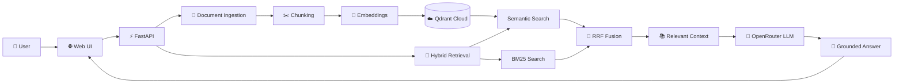

# 🧠 DocMind

### Ask your documents. Get grounded answers.

DocMind is a lightweight **Retrieval-Augmented Generation (RAG)** assistant that lets you upload documents and ask questions about them.

It combines **semantic search + BM25 keyword retrieval** to find relevant context before generating an answer with an LLM.

> Built to explore how modern RAG systems actually work — from document ingestion to grounded answers.

---

## ✨ Features

- 📄 Upload TXT, PDF & DOCX documents
- 🧩 Smart text chunking
- 🧠 OpenRouter embeddings
- 🔎 Semantic vector search with Qdrant
- 🔤 BM25 keyword search
- 🔀 Hybrid retrieval with RRF
- 🤖 Grounded LLM responses
- 📚 Source-aware answers
- ♻️ SHA-256 document deduplication
- 🧪 Retrieval evaluation
- ⚡ Lightweight & low-resource friendly

---

## 🏗️ Architecture



---

## 🧰 Tech Stack

| Component        | Technology                    |
| ---------------- | ----------------------------- |
| Backend          | FastAPI                       |
| Frontend         | HTML, CSS, Vanilla JavaScript |
| Vector Database  | Qdrant Cloud                  |
| Embeddings       | OpenRouter                    |
| LLM              | OpenRouter                    |
| Semantic Search  | Qdrant vector search          |
| Keyword Search   | BM25                          |
| Ranking          | Reciprocal Rank Fusion        |
| Document Formats | TXT, PDF, DOCX                |
| Language         | Python                        |
| Testing          | Python test modules           |
| Configuration    | `.env`                        |

---

## 📁 Project Structure
```
docmind-rag/
│
├── app/
│   ├── database/
│   │   └── qdrant_db.py
│   │
│   ├── ingestion/
│   │   ├── loader.py
│   │   ├── chunker.py
│   │   ├── embedder.py
│   │   └── ingest.py
│   │
│   ├── retrieval/
│   │   └── retriever.py
│   │
│   ├── config.py
│   └── main.py
│
├── documents/
│   └── uploaded documents
│
├── static/
│   ├── app.js
│   └── style.css
│
├── templates/
│   └── index.html
│
├── tests/
│   └── test_rag.py
│
├── docs/
│   ├── technical-documentation.md
│   ├── user-guide.md
│   └── project-companion-guide.md
│
├── .env
├── .gitignore
├── requirements.txt
└── README.md
```
---

## 💻 Designed for Low-Resource Machines

DocMind was intentionally designed around a lightweight local architecture.

Instead of running large AI models locally:
```
Local computer
     │
     ├── FastAPI
     ├── Document processing
     ├── Chunking
     └── Web interface
              │
              ▼
        Cloud services
        ├── OpenRouter
        └── Qdrant Cloud
```
---

## 📚 Documentation

### Want to go deeper?

| Document                                                      | Description                                                 |
| ------------------------------------------------------------- | ----------------------------------------------------------- |
| [📘 Technical Documentation](docs/technical-documentation.md) | Architecture, implementation, retrieval and backend details |
| [📖 User Guide](docs/user-guide.md)                           | Installation, usage and troubleshooting                     |
| [🧭 Project Companion Guide](docs/project-companion-guide.md) | Project decisions, learning journey and development notes   |
